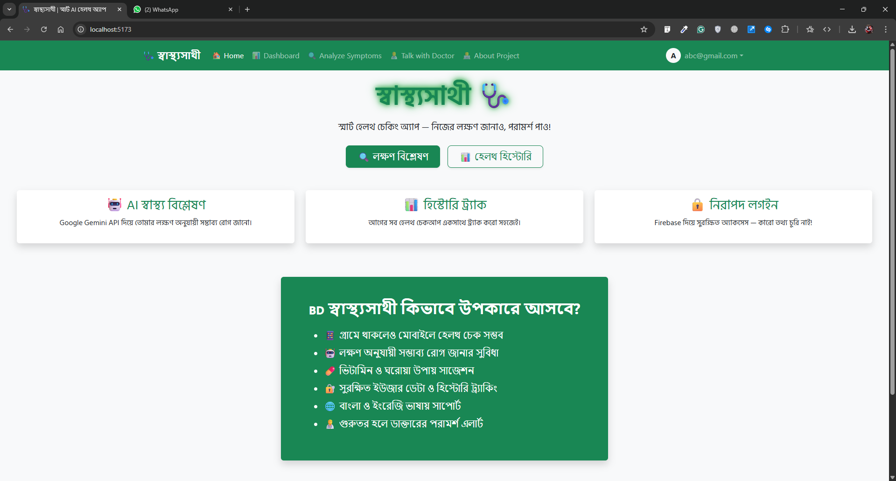

# 🩺 HealthBuddy (স্বাস্থ্যসাথী)

**HealthBuddy** is an AI-powered health-checking web app where users can enter their symptoms and receive smart suggestions for possible diseases, required vitamins, basic medicines, and advice — all in a clean green UI with chill animations. 😷✨

> 📚 Made for: **ICT Olympiad Project**  
> 🏫 School: _[Scholarshom Majortila College]_  
> 👦 Developer: _[Istiyaq khan razin]_

---

## ✨ Features

- 🤖 AI-powered symptom analysis (using **Google Gemini Pro API**)
- ✍️ Bangla & English symptom input
- 💊 Suggests medicines & essential vitamins
- 🧑‍⚕️ Warns user when to consult a doctor
- 🔐 Secure login using **Firebase Authentication**
- 💾 User data saved using **MongoDB**
- 🌿 Minimal, clean UI using **bootstrap**

---

## 🛠️ Tech Stack

| Frontend | Backend | AI | Auth | DB |
|----------|---------|----|------|----|
| React    | Express | Gemini API | Firebase | MongoDB |

---

## 🧪 Screenshots

 
 `

---

## 🚀 Getting Started (Local Development)

### 1. Clone the Repo

```bash
git https://github.com/Istiyaq-Khan/Health-Buddy.git
cd healthbuddy-app
```
```bash
cd backend
npm run dev
```
```bash
cd frontend
npm run dev
```

